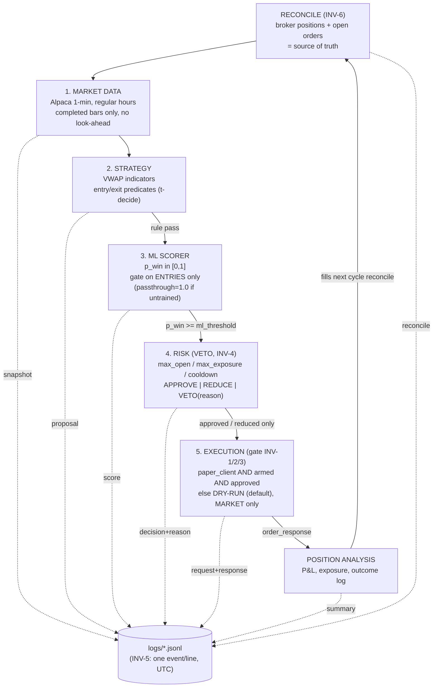
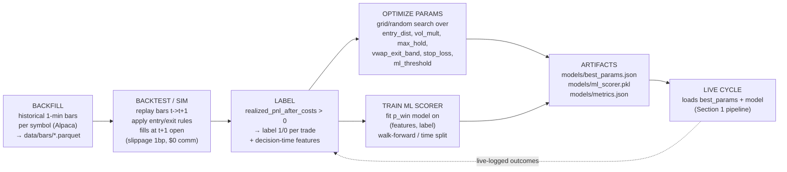
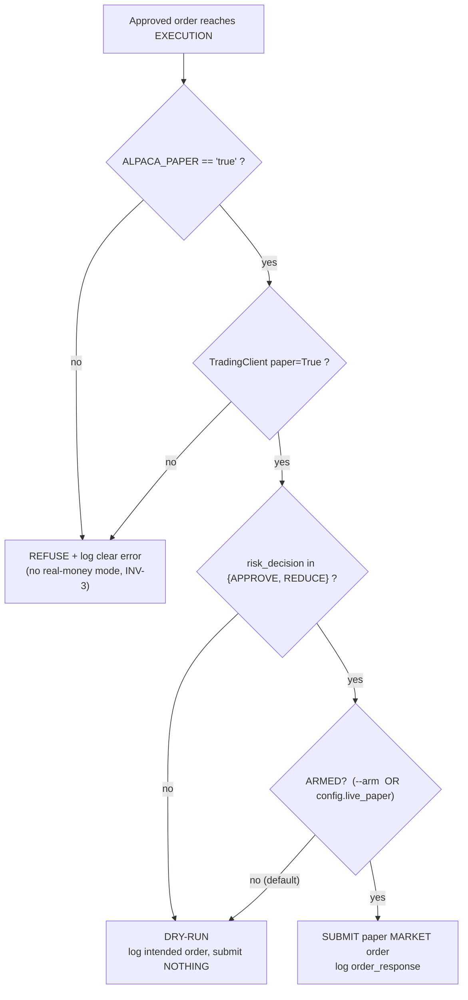

# ARCHITECTURE.md — Agentic VWAP Mean-Reversion Trader (PAPER ONLY)

> Companion to `STRATEGY_RULES.md`. This file fixes the agent topology, the offline
> training loop, the dry-run/arm safety gate, the JSONL logging flow, and the
> directory layout. PAPER only; deterministic trade loop; ML is a learned entry gate.

---

## 1. FIVE-AGENT LIVE PIPELINE (ASCII)

```
                         ┌──────────────────────────────────────────────┐
                         │   RECONCILE (start of every cycle, INV-6)      │
                         │   broker positions + open orders = source of   │
                         │   truth → rebuild position_state               │
                         └───────────────────────┬────────────────────────┘
                                                 │
        ┌────────────────┐      bars     ┌───────▼────────┐   proposal    ┌──────────────┐
        │  ① MARKET DATA  │ ───────────▶ │  ② STRATEGY     │ ────────────▶ │ ③ ML SCORER  │
        │  Alpaca 1-min   │  completed,  │  VWAP indicators│   (rule pass) │  p_win∈[0,1] │
        │  regular hours  │  no look-    │  entry/exit     │               │  gate on     │
        │  (Sec 2 data)   │  ahead       │  predicates     │               │  ENTRIES only│
        └────────────────┘              └────────────────┘               └──────┬───────┘
                                                                                 │ p_win>=
                                                                                 │ ml_threshold
                                                                                 ▼
                                            ┌───────────────────────────────────────────┐
                                            │  ④ RISK  (VETO authority, INV-4)            │
                                            │  max_open_positions / max_total_exposure /  │
                                            │  per-symbol cooldown → APPROVE | REDUCE |   │
                                            │  VETO(reason)  ; SELL always APPROVE (A12)   │
                                            └───────────────────┬─────────────────────────┘
                                                  approved only │
                                                                ▼
                  ┌──────────────────────────────────────────────────────────────────┐
                  │  ⑤ EXECUTION  (SAFETY GATE, INV-1/2/3)                              │
                  │    submit IFF  paper_client && armed && risk_approved              │
                  │    else DRY-RUN: log intended order, submit NOTHING (default)      │
                  │    ALPACA_PAPER != "true"  →  refuse + clear error (no live mode)   │
                  │    simple MARKET orders only (no bracket/OCO/stop)                  │
                  └───────────────────────────────┬──────────────────────────────────┘
                                                   │ order_response
                                                   ▼
                                  ┌──────────────────────────────────┐
                                  │  POSITION ANALYSIS                 │
                                  │  realized/unrealized P&L, exposure │
                                  │  → feeds outcome log → ML labels   │
                                  └──────────────────────────────────┘

      ── EVERY arrow above also emits a JSONL event to logs/ (INV-5) ──
```

---

## 2. FIVE-AGENT LIVE PIPELINE (mermaid)



---

## 3. OFFLINE TRAINING LOOP (backfill → label → optimize + train → artifacts → live)



Key offline rules (mirror `STRATEGY_RULES.md`):
- **No look-ahead**: features use bars `[0..t]`; only the label may use post-entry bars.
- **t → t+1 fills**: backtest fills entries/exits at the next bar's open; last-bar entries
  dropped, `eod_flatten` fills at close if no t+1 (A10).
- **Costs explicit**: `$0` commission, `1 bp` adverse slippage, so sim and live agree (A11).
- **Walk-forward**: train the ML scorer on an earlier window, validate on a later one;
  `ml_threshold` is only raised above 0.0 after the model beats rule-only on validation.
- **Passthrough**: until a validated model exists, scorer returns `1.0` and the system
  runs rule-only with `ml_threshold = 0.0`.

---

## 4. DRY-RUN / ARM SAFETY GATE (decision flow)



Default with no flags: **DRY-RUN** (logs intent, submits nothing). Submitting real paper
orders requires explicit `--arm` (or `config.live_paper=true`) AND a paper account.

---

## 5. JSONL LOGGING FLOW (INV-5)

All events append to `/Users/pnle/Desktop/alpaca-cli/logs/`, one JSON object per line,
UTC ISO-8601 `ts`. One file per UTC day, e.g. `logs/trader-2026-06-04.jsonl`; errors
also tee to `logs/errors-2026-06-04.jsonl`.

```
{"ts":"...Z","type":"data_snapshot",    "symbol":"AAPL","session_vwap":..., "last_price":..., "dist_from_vwap":..., "volume_ratio":..., "n_bars":...}
{"ts":"...Z","type":"strategy_proposal","symbol":"AAPL","side":"buy","notional":100.0,"reason":"vwap_meanrev","features":{...}}
{"ts":"...Z","type":"ml_score",         "symbol":"AAPL","p_win":0.62,"ml_threshold":0.0,"gate":"pass"}
{"ts":"...Z","type":"risk_decision",    "symbol":"AAPL","decision":"VETO","reason":"cooldown"}
{"ts":"...Z","type":"order_request",    "symbol":"AAPL","side":"buy","notional":100.0,"mode":"dry_run"}
{"ts":"...Z","type":"order_response",   "symbol":"AAPL","broker_order_id":"...","status":"accepted"}
{"ts":"...Z","type":"position_summary", "open":[{"symbol":"AAPL","qty":..., "market_value":..., "unrealized_plpc":...}], "exposure":...}
{"ts":"...Z","type":"error",            "where":"market_data","msg":"...","traceback":"..."}
```

Required event types (every one must appear): `data_snapshot`, `strategy_proposal`,
`ml_score`, `risk_decision`, `order_request`, `order_response`, `position_summary`, `error`.

---

## 6. DIRECTORY LAYOUT (to be built)

```
/Users/pnle/Desktop/alpaca-cli/
├── .env                         # EXISTING — reuse, DO NOT MODIFY (keys + ALPACA_PAPER=true)
├── alpaca_cli.py                # EXISTING — DO NOT MODIFY
├── logs/                        # JSONL event logs (INV-5); created at runtime
│   ├── trader-YYYY-MM-DD.jsonl
│   └── errors-YYYY-MM-DD.jsonl
└── agentic_trader/              # this package
    ├── STRATEGY_RULES.md        # ← spec (this PR)
    ├── ARCHITECTURE.md          # ← this file (this PR)
    ├── __init__.py
    ├── config.py                # defaults + param load (best_params.json), CLI/--arm, live_paper
    ├── broker.py                # Alpaca TradingClient (paper) + market-data client; reconcile()
    ├── indicators.py            # Section 2 formulas: vwap, dist, rolling20, volume_ratio
    ├── features.py              # Section 5.1 decision-time feature vector
    ├── agents/
    │   ├── __init__.py
    │   ├── market_data.py       # ① fetch completed regular-hours 1-min bars (no look-ahead)
    │   ├── strategy.py          # ② entry/exit predicates → proposals
    │   ├── ml_scorer.py         # ③ load model, p_win, gate (passthrough=1.0 if untrained)
    │   ├── risk.py              # ④ caps + VETO/REDUCE/APPROVE with logged reasons
    │   ├── execution.py         # ⑤ safety gate (INV-1/2/3), MARKET orders, dry-run default
    │   └── position_analysis.py # P&L / exposure / outcome → ML labels
    ├── logging_jsonl.py         # INV-5 append-only JSONL writer (UTC), error tee
    ├── runner.py                # one run_cycle() + live loop entrypoint (Sec 10 of rules)
    ├── backtest/
    │   ├── __init__.py
    │   ├── backfill.py          # pull historical 1-min bars → data/bars/*.parquet
    │   ├── simulator.py         # t->t+1 replay, fills, slippage/cost model (A11)
    │   ├── label.py             # realized_pnl_after_costs>0 → labels + features
    │   └── optimize.py          # param search + walk-forward; writes best_params/metrics
    ├── train/
    │   └── train_ml.py          # fit p_win model → models/ml_scorer.pkl + metrics.json
    ├── models/                  # artifacts (gitignore data; keep small json)
    │   ├── best_params.json     # tuned trainable params
    │   ├── ml_scorer.pkl        # trained scorer (absent ⇒ passthrough 1.0)
    │   └── metrics.json         # validation metrics, walk-forward results
    ├── data/
    │   └── bars/                # cached historical bars (parquet); gitignored
    └── tests/
        ├── test_indicators.py   # vwap/rolling20 windowing, no-look-ahead
        ├── test_strategy.py     # entry/exit predicate truth tables
        ├── test_risk.py         # caps, cooldown, exposure REDUCE/VETO
        ├── test_execution.py    # dry-run default, arm gate, paper refusal (INV-1/2/3)
        └── test_simulator.py    # t->t+1 fills, slippage, eod flatten (A9/A10)
```

Run commands (all from project root, absolute):
```
cd /Users/pnle/Desktop/alpaca-cli && python3 -m agentic_trader.runner            # DRY-RUN (default)
cd /Users/pnle/Desktop/alpaca-cli && python3 -m agentic_trader.runner --arm      # submit paper orders
cd /Users/pnle/Desktop/alpaca-cli && python3 -m agentic_trader.backtest.backfill
cd /Users/pnle/Desktop/alpaca-cli && python3 -m agentic_trader.backtest.optimize
cd /Users/pnle/Desktop/alpaca-cli && python3 -m agentic_trader.train.train_ml
```

---

## 7. AGENT CONTRACTS (I/O at each hop)

| Agent | Input | Output | Logs |
|-------|-------|--------|------|
| ① Market Data | symbol, now | `SessionBars` (completed, regular) + indicators | `data_snapshot` |
| ② Strategy | indicators, position_state | `Proposal{side, symbol, notional/qty, reason}` | `strategy_proposal` |
| ③ ML Scorer | features (decision-time) | `p_win`, gate pass/fail (entries only) | `ml_score` |
| ④ Risk | proposal, reconciled broker state, in-cycle approvals | `APPROVE \| REDUCE \| VETO(reason)` | `risk_decision` |
| ⑤ Execution | approved order, config(arm/paper) | broker response or DRY-RUN | `order_request`, `order_response` |
| Position Analysis | broker positions, fills | P&L, exposure, trade outcomes → labels | `position_summary` |

Strategy PROPOSES; Risk DISPOSES (veto authority); Execution only ever sees risk-approved
orders, and only submits when explicitly armed on a verified paper account.
